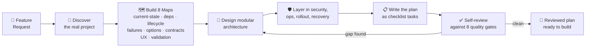

<div align="center">

# 🧭 Robust Feature Planning Prompt

### Turn vague feature requests into **senior-grade implementation plans.**

A battle-tested, stack-agnostic prompt that makes any AI coding assistant *think like a principal engineer* — discovering the real system, mapping failure modes, designing safe contracts, and planning a rollout that won't regress production.

<br>


<br>

**A single prompt.** Drop it into Claude Code, ChatGPT, Gemini, Cursor, Copilot Chat, or any LLM. It returns a complete, reviewed, checklist-driven plan — no code changes, no assumptions from memory.

</div>

---

## 📑 Table of Contents

| | Section | | Section |
|:---:|:---|:---:|:---|
| 🎯 | [The 30-Second Pitch](#-the-30-second-pitch) | 🧠 | [The 8 Thinking Disciplines](#-the-8-thinking-disciplines) |
| 🔥 | [The Problem It Solves](#-the-problem-it-solves) | 🛡️ | [What The Prompt Enforces](#%EF%B8%8F-what-the-prompt-enforces) |
| ⚡ | [Quick Start](#-quick-start) | 🗺️ | [The Output Blueprint](#%EF%B8%8F-the-output-blueprint) |
| 🔬 | [How It Works](#-how-it-works) | 🛠️ | [The Planning Lifecycle](#%EF%B8%8F-the-planning-lifecycle) |
| 📋 | [Plan Review Checklist](#-plan-review-checklist) | ❓ | [FAQ](#-faq) |

---

## 🎯 The 30-Second Pitch

Ask an AI to *"plan this feature"* and you usually get a confident-sounding to-do list that **skips discovery, ignores failure modes, and quietly assumes your stack.** Weeks later you discover the hard way that it forgot idempotency, missed a migration rollback, or assumed a schema that doesn't exist.

**This prompt fixes that.** It forces the AI to:

1. 🔎 **Discover the real project first** — read the actual code, schema, and config; never guess from memory.
2. 🧱 **Design modularly** — every module owns one responsibility and talks through a narrow, typed contract.
3. 💥 **Plan for failure** — what fails open vs. closed, what retries, what alerts, what can be replayed or repaired.
4. 🛡️ **Treat security, UX, and rollout as first-class** — not afterthoughts bolted on at the end.

> 💡 **The result:** a plan that's safe to execute in real production, modular enough to evolve, and explicit about how it avoids regressions.

---

## 🔥 The Problem It Solves

Most AI-generated plans share the same five flaws. This prompt was written specifically to eliminate them:

| ❌ The Flaw | ✅ What This Prompt Forces Instead |
|:---|:---|
| **Assumes your stack** from training memory | Discovers the actual repo, schema, and config *before* designing |
| **Skips failure modes** ("happy path only") | Builds a full failure-mode tree: timeouts, partial writes, stale schemas, rollbacks… |
| **No contract thinking** | Maps every inbound/outbound request, webhook, and event with versioning + idempotency |
| **Treats UX as decoration** | Plans empty / loading / error / disabled / success states up front |
| **No rollback path** | Every migration and deploy step has a rollback or repair path |

---

## ⚡ Quick Start

You can be planning like a senior engineer in **under a minute**.

### 1 · Grab the prompt
📄 The full prompt lives in [`WAGroupChat-Robust-Feature-Planning-Prompt.md`](./WAGroupChat-Robust-Feature-Planning-Prompt.md).

### 2 · Fill in two placeholders

```text
<FEATURE_REQUEST>
Describe the feature here.
</FEATURE_REQUEST>

<PROJECT_CONTEXT>
Stack, goals, constraints, roles, services, deadlines, or files to inspect.
(Leave blank to let the AI discover the project itself.)
</PROJECT_CONTEXT>
```

### 3 · Send it to any AI assistant

<details>
<summary><b>👉 In Claude Code (recommended)</b></summary>

Give Claude Code the tools to *actually inspect* your project — database/schema tools, API docs, repo access — and it will discover the real system instead of guessing. The prompt is explicitly written to use available project tools.

```bash
# Inside your repo, in Claude Code:
/paste the prompt with your <FEATURE_REQUEST> filled in
```

The plan it returns will be grounded in your real code, schemas, and contracts.

</details>

<details>
<summary><b>👉 In ChatGPT / Gemini / any web LLM</b></summary>

Paste the prompt, fill in `<FEATURE_REQUEST>`, and add any relevant context to `<PROJECT_CONTEXT>` (stack, schema snippets, constraints). Even without live tool access, the prompt's discipline produces a far stronger plan than a naïve request.

</details>

<details>
<summary><b>👉 In Cursor / Copilot Chat / IDE assistants</b></summary>

Open it in a workspace with your codebase. The discovery instructions ("read available repo instructions, README files, architecture docs, package/config files, and nearby code") steer IDE-based assistants to ground the plan in your actual files.

</details>

<br>

> 🎁 **Pro tip:** Leave `<PROJECT_CONTEXT>` blank on purpose. The prompt is designed to *discover* the project — and forcing the AI to investigate often surfaces things you'd have forgotten to mention.

---

## 🔬 How It Works

The prompt is built on a simple but powerful principle: **discover before you design, design before you decide, review before you finish.**



That **feedback loop** at the end is the secret: the AI is required to review its own plan against eight quality gates *before returning it*, and to fix any gap it finds. The plan you get has already been through one round of QA.

---

## 🧠 The 8 Thinking Disciplines

Before the AI writes a single line of the plan, the prompt forces it to privately construct eight mental maps. These are the same maps a senior engineer holds in their head — made explicit so nothing slips through.

| # | Map | What It Forces The AI To See |
|:---:|:---|:---|
| 1️⃣ | **Current-State** | Where data *enters, transforms, is stored, displayed*, and where side effects happen |
| 2️⃣ | **Dependency** | Every function, service, table, queue, job, permission, and UI path that could be affected |
| 3️⃣ | **Lifecycle** | Create · read · update · delete · sync · retry · disable · recover · audit · migrate · remove |
| 4️⃣ | **Failure-Mode** | Invalid input, bad auth, network failure, third-party outage, partial writes, rate limits, rollbacks… |
| 5️⃣ | **Option** | At least **3 viable approaches**: conservative · modular/scalable · fastest-acceptable |
| 6️⃣ | **Contract** | Inbound/outbound requests, webhooks, callbacks, batch flows, realtime, admin APIs |
| 7️⃣ | **UX** | Who configures vs. uses it, and every empty/error/loading/disabled/success state |
| 8️⃣ | **Validation** | The full ladder: static · unit · integration · contract · security · failure-mode · UI · migration · smoke · rollback |

> ⚙️ The AI is told **not** to dump its chain-of-thought. You get the *findings, risks, and decisions* — concise and useful, not a wall of internal reasoning.

---

## 🛡️ What The Prompt Enforces

The prompt encodes a non-negotiable quality bar. Every plan it produces must satisfy these rules:

### 🧱 Modularity & Non-Regression
- Each module owns **one responsibility** and communicates through typed helpers or narrow APIs.
- Optional integrations, external calls, webhooks, and workers **must be able to fail without breaking core product behavior.**

### 💥 Explicit Failure Behavior
- What **fails open vs. closed**, what's retried, what's logged, what alerts, what's visible to users/admins, and what can be **replayed or repaired.**

### 📜 Contracts Designed For Change
- **Versioning**, backwards compatibility, **idempotency**, pagination/cursors, ordering, deduplication, redaction, and schema evolution.

### 🔐 Security & Privacy From The Start
- Auth, authorization, tenant/user isolation, least privilege, secret storage, **key rotation/revocation**, audit logs, **redacted logs**, retention, and safe browser exposure.

### 📡 Operations & Observability
- Logs, metrics, traces, delivery history, retries, replay, backfill, reconciliation, health checks, diagnostics, admin tooling, rate limits, quotas, and alert thresholds.

### 🚦 Safe Rollout
- Feature flags / config gates, migration strategy, backwards-compatible deployment order, **rollback path**, data repair path, and staged release checks.

---

## 🗺️ The Output Blueprint

Every plan follows the same predictable structure, so you always know where to look — and so two different people using the prompt get comparable, reviewable documents.

```
1.  Title
2.  Document Control
3.  Feature Summary
4.  Current-State Findings          ← what the AI discovered about your real system
5.  Assumptions And Open Questions  ← stated explicitly, each with its risk
6.  Goals And Non-Goals
7.  Non-Negotiable Design Rules
8.  Risk And Issue Register
9.  Branch Review And Chosen Architecture   ← why this option over the others
10. Module Map
11. Data And Persistence Plan       ← only when DB work is involved
12. API, Event, And Contract Plan   ← only when integration work is involved
13. UI/UX Plan                      ← only when UI work is involved
14. Security And Privacy Plan
15. Failure Isolation And Recovery Plan
16. Operations, Observability, And Support Plan
17. Rollout, Migration, And Rollback Plan
18. Implementation Phases With Checklist Tasks   ← the actual to-do, in dependency order
19. Validation Plan
20. Done Criteria
```

Implementation tasks use markdown checkboxes (`- [ ]`) — ready to drop into a tracker, a PR description, or a project board.

<details>
<summary><b>📖 Deep-dive: the conditional sections (11–13)</b></summary>

Sections **11, 12, and 13 are conditional.** The prompt only asks for them *when that kind of work is actually involved* — so a pure-logic refactor doesn't get padded with a fake "API Plan," and a backend integration doesn't skip the database section it needs.

This keeps every plan **complete without being bloated.**

</details>

---

## 🛠️ The Planning Lifecycle

The prompt doesn't just plan the happy path — it plans the **entire lifecycle** of the feature, the way someone who'll have to maintain it for years would:

```
 CREATE  ──▶  READ  ──▶  UPDATE  ──▶  DELETE
    │           │           │            │
    ▼           ▼           ▼            ▼
  SYNC  ──▶  RETRY  ──▶  DISABLE  ──▶  RECOVER
                                        │
                                        ▼
              AUDIT  ◀──  MIGRATE  ◀──  REMOVE
```

Every plan considers what happens at **each** of these stages — including the unglamorous ones (disable, recover, audit, migrate, remove) that most plans skip and most incidents come from.

---

## 📋 Plan Review Checklist

The prompt ships with a built-in **review checklist** — the same quality bar the AI self-checks against. Use it yourself to grade any plan (human- or AI-generated):

<details>
<summary><b>🔓 Click to expand the full review checklist</b></summary>

- [ ] Discovers the actual project structure before designing.
- [ ] Avoids references to a specific repository, runbook, or fixed stack unless supplied.
- [ ] Captures assumptions, open questions, risks, and issues **before** the final design.
- [ ] Compares **at least 3 implementation options** before choosing one.
- [ ] Chooses the **simplest robust modular** architecture.
- [ ] Makes non-regression and failure isolation explicit.
- [ ] Defines module ownership and communication contracts.
- [ ] Covers inbound APIs, outbound APIs, sync/pull APIs, background jobs, webhooks, callbacks, realtime flows, and admin APIs where relevant.
- [ ] Covers versioning, auth, scopes, headers, payloads, errors, idempotency, pagination, filtering, ordering, redaction, and compatibility.
- [ ] Uses the discovered data model and relationships instead of assuming payloads.
- [ ] Covers UI/UX setup, prerequisites, disabled states, guidance, test actions, saved test results, health, and recovery.
- [ ] Covers security, privacy, tenant/user isolation, secret storage, rotation, audit, retention, and redacted logs.
- [ ] Covers logs, retries, replay, backfill, reconciliation, diagnostics, dashboards, quotas, and alerts.
- [ ] Orders implementation phases by dependency.
- [ ] Includes validation and done criteria.

</details>

---

## ❓ FAQ

<details>
<summary><b>Does this only work for a specific stack?</b></summary>

**No — that's the whole point.** The prompt is deliberately stack-agnostic. It discovers your actual stack (frontend, backend, DB, storage, auth, external services, deploy path) from your repo and tools, rather than assuming one. It works equally well for a Node/React app, a Python service, a mobile app, or a no-code automation stack.

</details>

<details>
<summary><b>Why does the filename say "WAGroupChat"?</b></summary>

The prompt was originally written while planning features for a **WhatsApp Group Chat** project — that's its provenance. But the prompt itself contains *zero* WhatsApp-specific assumptions, so it generalizes to any feature in any project. The name is kept for traceability; the content is universal.

</details>

<details>
<summary><b>Will the AI actually change my code?</b></summary>

**No.** The very first instruction is: *"Do not make code, database, infrastructure, or configuration changes unless explicitly asked."* The prompt produces a **plan**, not a diff. You stay in control of execution.

</details>

<details>
<summary><b>What if I don't fill in <code>&lt;PROJECT_CONTEXT&gt;</code>?</b></summary>

That's fine — and often *better*. The prompt is built to discover the project on its own by reading your repo, configs, and (with tool access) your live schema and API docs. Leaving it blank forces genuine discovery instead of trusting whatever context you happened to type.

</details>

<details>
<summary><b>Can I use this for non-software planning?</b></summary>

It's tuned for software feature implementation, but the *discipline* — discover before design, map dependencies, plan failure modes, compare options, define done criteria — transfers to systems, ops, and process design too. Try it and adapt.

</details>

---

## 🤝 Contributing

This prompt improves every time someone uses it on a messier, weirder real-world project and finds a gap. If you spot one:

1. **Open an issue** describing the situation the prompt didn't handle well.
2. **Open a PR** with a proposed addition — keep new instructions in the same imperative, stack-agnostic style.

When evolving the prompt, preserve its core contract: **it must stay readable, framework-agnostic, and produce a plan that's safe to execute in production.**

---

## 📄 License

Released under the **MIT License** — copy it, adapt it, bake it into your own team's playbook, ship products with it. Attribution is appreciated but not required.

If a different license fits your needs better, fork away.

---

<div align="center">

**⭐ If this prompt saved your team a production incident, give it a star.**

*Plan like the person who'll be on-call for it.*

</div>
